<div align="center">

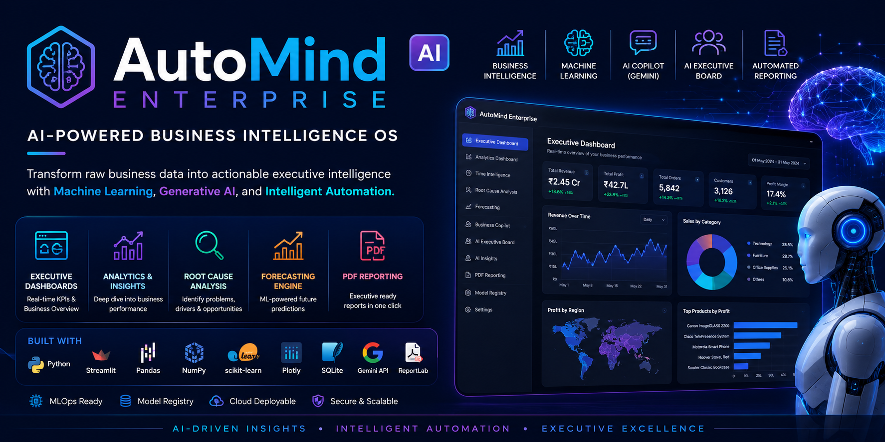
<br>


<div align="center">

# 🚀 AutoMind Enterprise

### AI-Powered Business Intelligence Operating System

**An enterprise-grade AI platform that transforms raw business data into actionable executive intelligence through Machine Learning, Business Intelligence, Forecasting, Generative AI, Agentic AI, and Automated Reporting.**

<br>

<p align="center">

<a href="https://automind-enterprise.streamlit.app/">

</a>

<a href="https://github.com/adityabhadauriawork/AutoMind-Enterprise">

</a>

</p>

<p align="center">


</p>

---

### 🌐 Live Demo

**https://automind-enterprise.streamlit.app/**

### 💻 GitHub Repository

**https://github.com/adityabhadauriawork/AutoMind-Enterprise**

---

*"Transforming business data into executive intelligence with AI-driven analytics, forecasting, intelligent copilots, and automated decision support."*

</div>

---

# 🌟 Project Vision

Modern organizations generate massive volumes of business data every day, yet extracting actionable insights often requires multiple disconnected analytics, reporting, forecasting, and AI tools.

**AutoMind Enterprise** unifies these capabilities into a single enterprise-grade AI Business Intelligence platform capable of transforming structured business datasets into meaningful executive intelligence.

The platform combines **Business Intelligence**, **Machine Learning**, **Forecasting**, **Generative AI**, **Agentic AI**, and **MLOps** to automate data analysis, identify business opportunities, forecast future performance, support executive decision-making, and generate professional business reports.

Rather than functioning as a traditional dashboard application, AutoMind Enterprise serves as an intelligent business decision support system designed to reduce manual analysis while enabling organizations to make faster, data-driven decisions.

---

# 🎯 Project Objectives

* Build a unified AI-powered Business Intelligence platform.
* Automate executive-level business analysis.
* Identify revenue opportunities and operational risks.
* Forecast future business performance using Machine Learning.
* Provide natural language business intelligence through Google Gemini.
* Generate executive-ready PDF reports automatically.
* Demonstrate an end-to-end AI Engineering workflow integrating Data Engineering, Business Intelligence, Machine Learning, Generative AI, and MLOps.

---

# ✨ Core Features

* 📊 Executive Dashboard
* 📈 Business Analytics Dashboard
* 📅 Time Intelligence Dashboard
* 🔍 Root Cause Analysis Engine
* 📉 Machine Learning Forecasting
* 🤖 AI Business Copilot (Google Gemini)
* 🧠 AI Executive Board
* 💡 AI Insights Engine
* 📄 Automated Executive PDF Reporting
* 🗄️ Model Registry (MLOps)
* ⚙️ Intelligent Dataset Validation
* 🌐 Cloud Deployment with Streamlit

---

# 🛠️ Technology Stack

| Category                  | Technologies                                                              |
| ------------------------- | ------------------------------------------------------------------------- |
| **Programming Language**  | Python                                                                    |
| **Frontend**              | Streamlit                                                                 |
| **Data Processing**       | Pandas, NumPy                                                             |
| **Machine Learning**      | Scikit-Learn                                                              |
| **Data Visualization**    | Plotly                                                                    |
| **Generative AI**         | Google Gemini API                                                         |
| **Business Intelligence** | Interactive Executive Dashboards                                          |
| **Database**              | SQLite                                                                    |
| **Reporting**             | ReportLab                                                                 |
| **Version Control**       | Git, GitHub                                                               |
| **Deployment**            | Streamlit Cloud                                                           |
| **Software Engineering**  | Modular Architecture, Error Handling, Data Validation, Session Management |
| **AI Engineering**        | Prompt Engineering, Executive Decision Support, Agentic AI, AI Insights   |
| **MLOps**                 | Model Registry, Model Persistence, Performance Tracking                   |

---


# 🏗️ System Architecture

```text
                                    Business Dataset
                                           │
                                           ▼
                            Data Validation & Cleaning
                                           │
                                           ▼
                         Business Feature Engineering Engine
                                           │
            ┌──────────────────────────────┼──────────────────────────────┐
            │                              │                              │
            ▼                              ▼                              ▼
   Executive Dashboard           Analytics Dashboard         Time Intelligence
            │                              │                              │
            └──────────────────────────────┼──────────────────────────────┘
                                           │
                                           ▼
                              Root Cause Analysis Engine
                                           │
                     ┌─────────────────────┴─────────────────────┐
                     │                                           │
                     ▼                                           ▼
            Machine Learning                          AI Insights Engine
             Forecasting                                     │
                     │                                       ▼
                     └──────────────► Business Copilot ◄──────┘
                                          (Google Gemini)
                                                  │
                                                  ▼
                                      AI Executive Board
                                                  │
                                                  ▼
                                     Executive PDF Reporting
```

---

# 🔄 End-to-End Workflow

```text
Business Dataset
        │
        ▼
Upload Dataset
        │
        ▼
Automatic Validation
        │
        ▼
Data Cleaning
        │
        ▼
Business Feature Engineering
        │
        ▼
Interactive Dashboards
        │
        ▼
Machine Learning Forecasting
        │
        ▼
Root Cause Analysis
        │
        ▼
Google Gemini Business Copilot
        │
        ▼
AI Executive Board
        │
        ▼
Professional Executive PDF Report
```

---

# 📸 Application Showcase

## 🏠 Landing Experience

The application begins with an intuitive interface where users can upload their own business dataset or instantly explore AutoMind using the integrated demo dataset.

<p align="center">
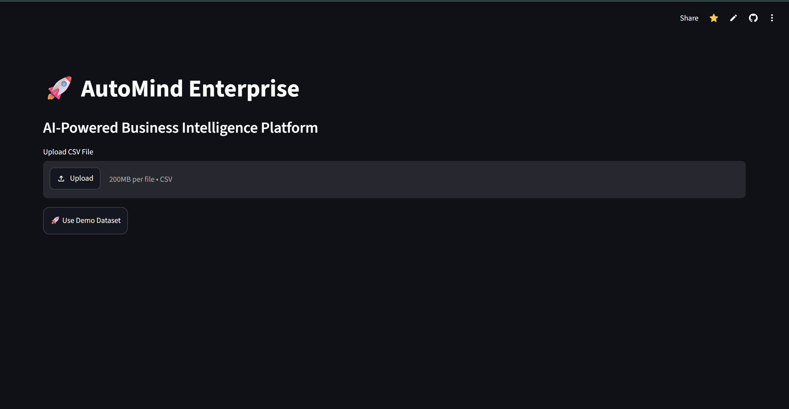
</p>

---

## 📊 Executive Dashboard

Provides an executive overview of business health using KPIs, revenue, profit, customer metrics, order statistics, and regional performance.

<p align="center">
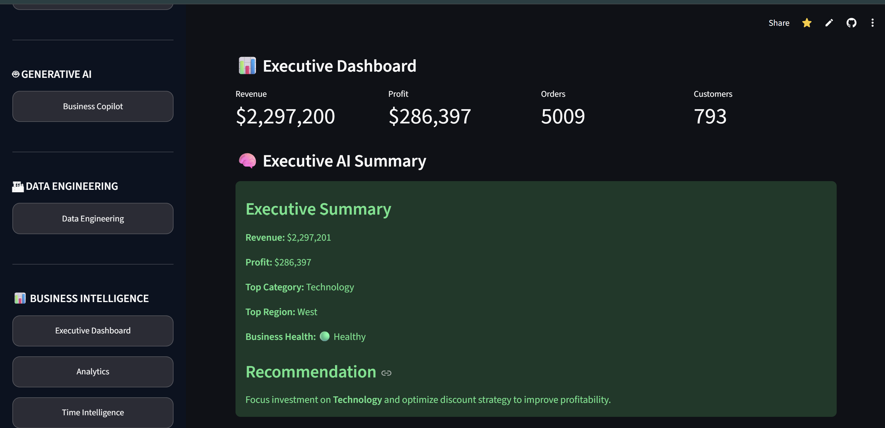
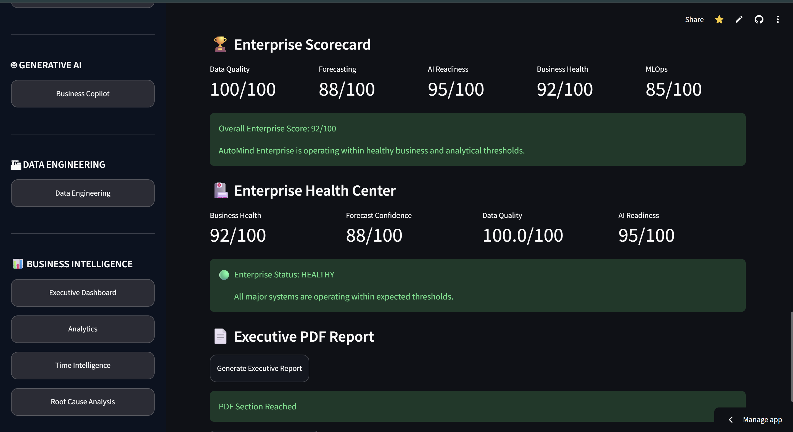
</p>

---

## 📈 Business Analytics Dashboard

Interactive analytics helping decision makers understand profitability, category performance, customer behavior, and sales trends.

<p align="center">
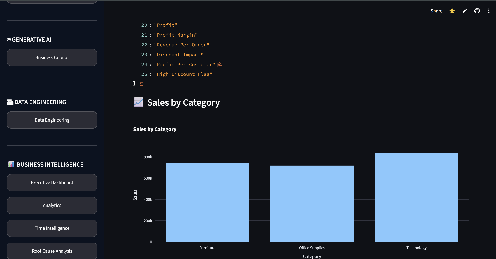
</p>

---

## 📅 Time Intelligence Dashboard

Analyze historical business performance, monthly growth, seasonality, and long-term business trends.

<p align="center">
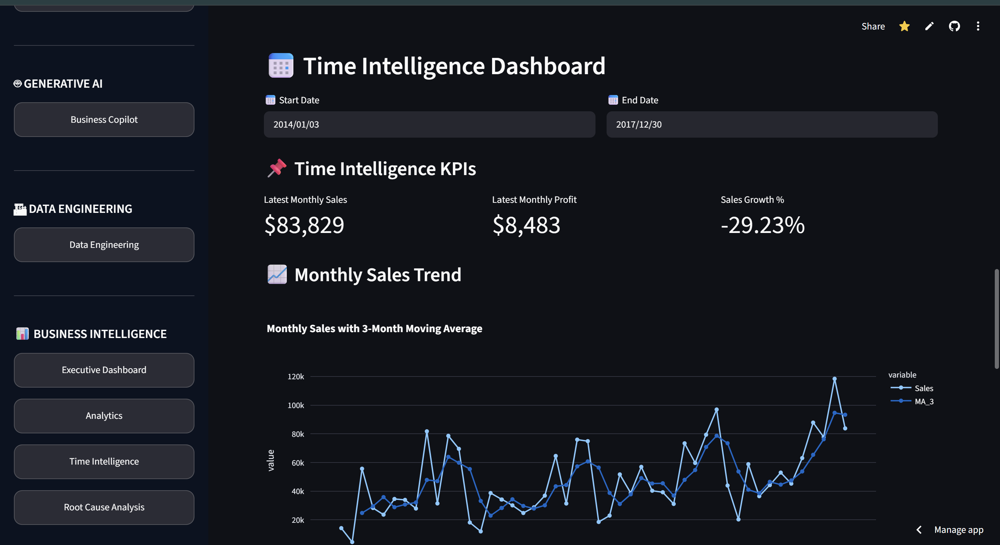
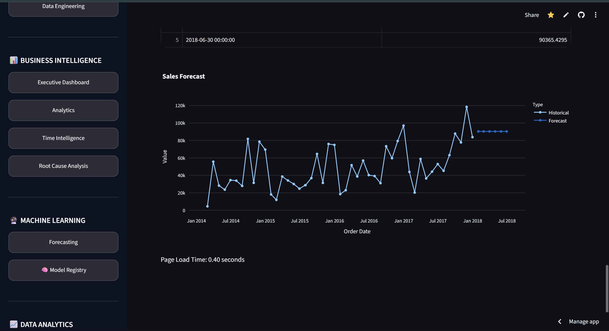
</p>

<p align="center">
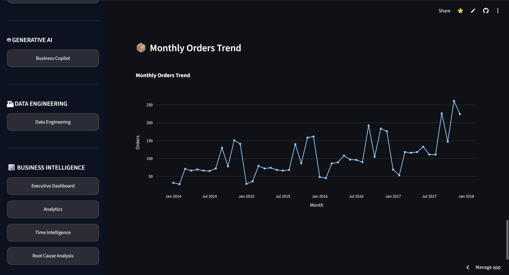
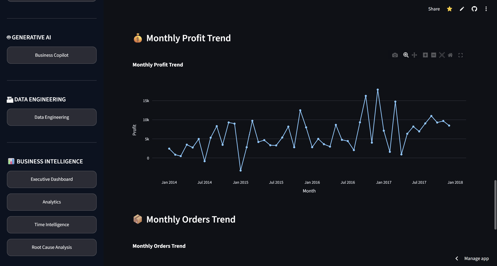
</p>

---

## 🔍 Root Cause Analysis Engine

Automatically identifies the exact products, regions, categories, and business segments responsible for declining profitability.

<p align="center">
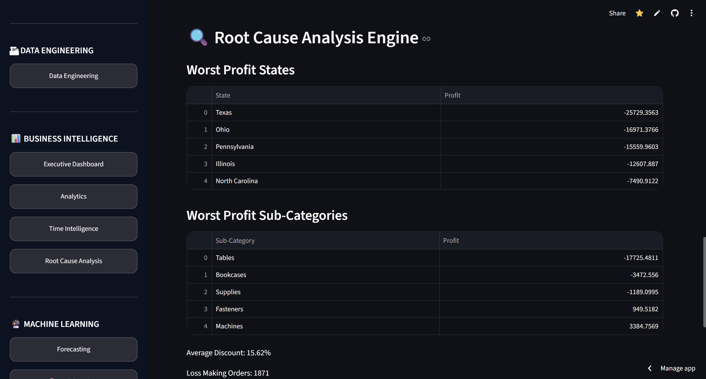
</p>

---

## 📉 Forecasting Engine

Machine Learning powered forecasting engine capable of predicting future business trends for strategic planning.

<p align="center">
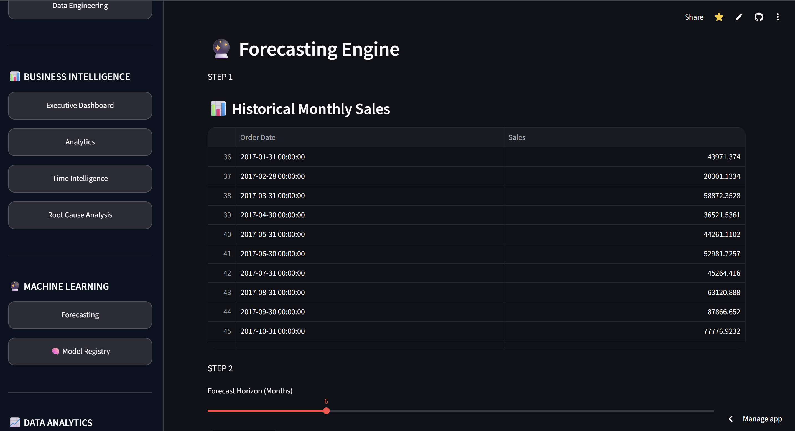
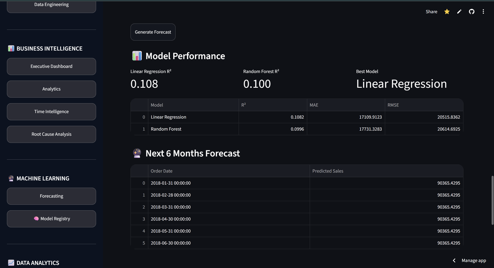
</p>

---

## 🤖 AI Business Copilot

Google Gemini powered Business Copilot capable of answering natural language business questions with intelligent recommendations.

<p align="center">
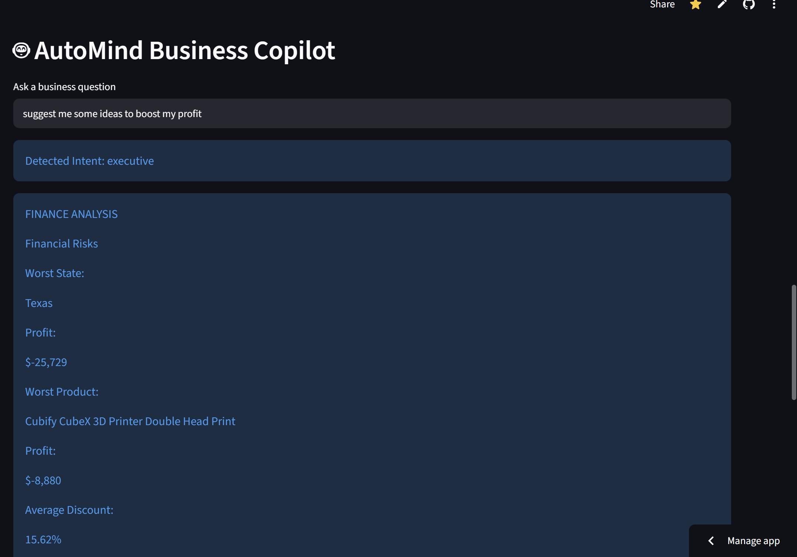
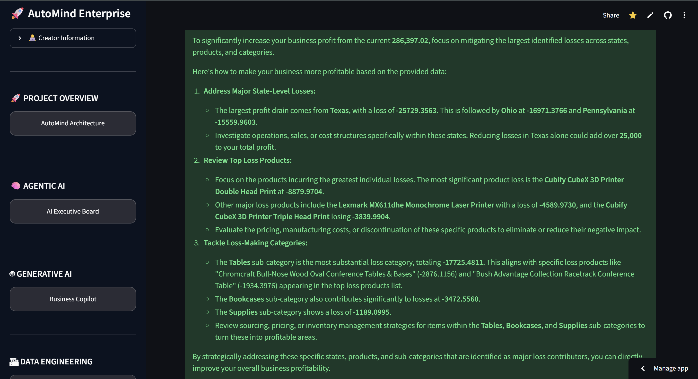
</p>

<p align="center">
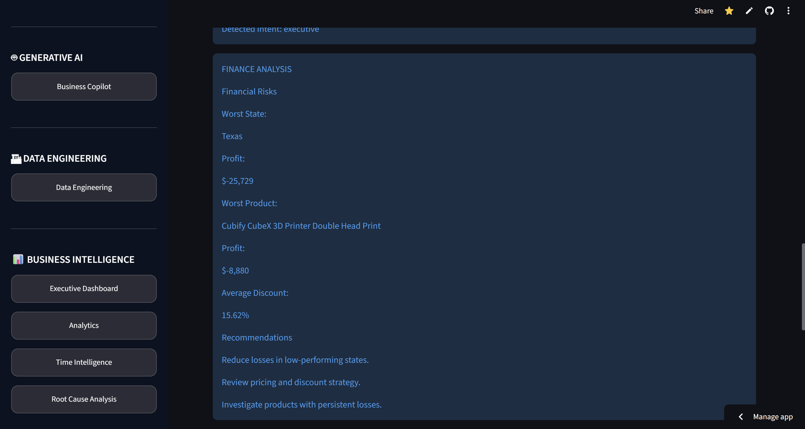
</p>

---

## 🧠 AI Executive Board

AI-powered executive assistant generating strategic business recommendations, growth opportunities, and executive summaries.

<p align="center">
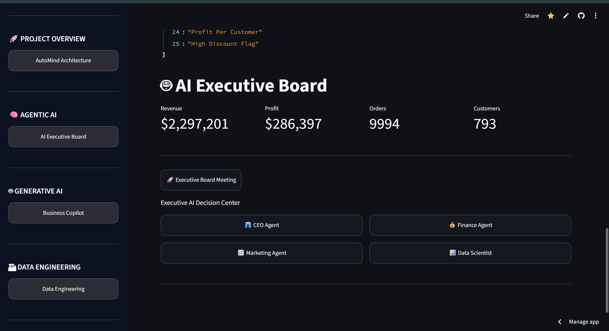
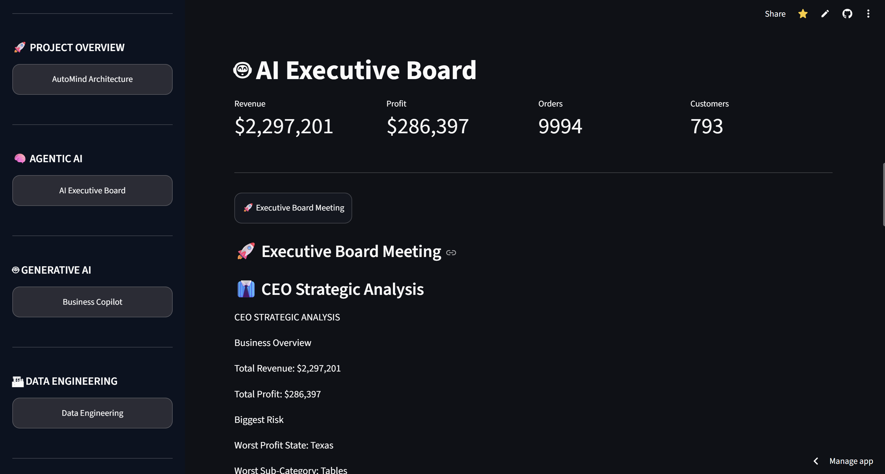
</p>

---

## 💡 AI Insights

Automatically generated AI-powered business insights highlighting opportunities, trends, and performance anomalies.

<p align="center">
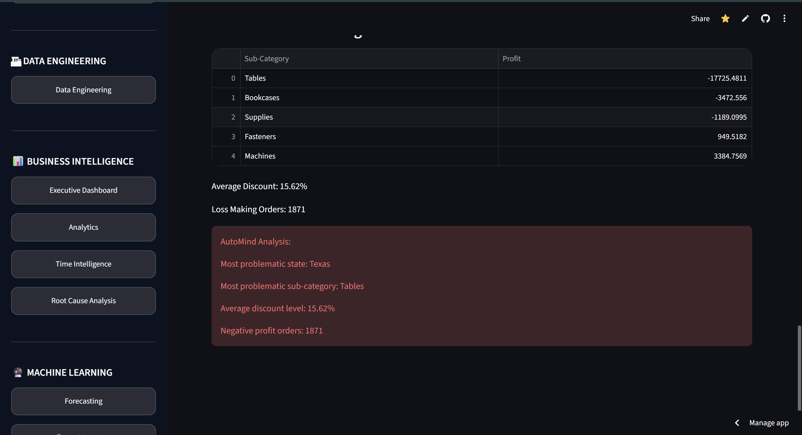
</p>

---

## 📄 Executive PDF Reporting

Generate professional executive reports containing KPIs, visualizations, forecasts, AI insights, and strategic recommendations with a single click.

<p align="center">
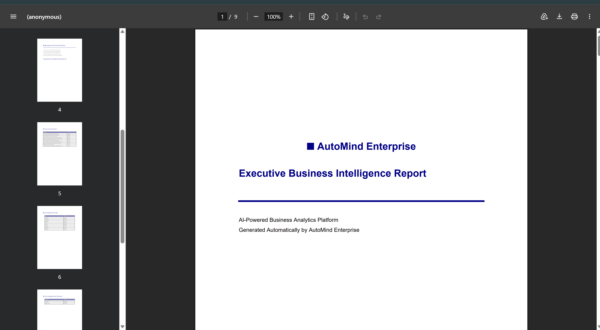
</p>

---

# 📁 Project Structure

```text
AutoMind Enterprise
│
├── agent/
│   ├── business_copilot.py
│   ├── executive_board.py
│
├── assets/
│   └── screenshots/
│
├── dashboard/
├── data/
├── database/
├── model/
├── report/
├── tests/
├── util/
│
├── app.py
├── requirements.txt
└── README.md
```

---

# 🤖 Artificial Intelligence Modules

AutoMind Enterprise integrates multiple AI systems that work together to automate business analysis, forecasting, executive reporting, and strategic decision support.

---

## 🤖 Business Copilot

The Business Copilot is powered by **Google Gemini** and enables users to interact with their business data using natural language.

### Capabilities

* Natural language business queries
* Executive-level recommendations
* Business performance explanations
* Strategic planning assistance
* Data-driven decision support
* Intelligent business summaries

---

## 🧠 AI Executive Board

The AI Executive Board simulates an executive management team capable of analyzing overall business performance.

### Responsibilities

* Executive business summaries
* Risk identification
* Opportunity detection
* Strategic recommendations
* Business health evaluation
* Growth planning

---

## 💡 AI Insights Engine

Automatically discovers meaningful business intelligence from uploaded datasets.

### Generated Insights

* Hidden sales trends
* Profitability analysis
* Regional performance
* Customer behavior
* Category performance
* Business opportunities
* Operational risks

---

# 📊 Machine Learning Pipeline

AutoMind Enterprise implements an end-to-end Machine Learning workflow.

```text
Business Dataset
        │
        ▼
Dataset Validation
        │
        ▼
Missing Value Handling
        │
        ▼
Business Feature Engineering
        │
        ▼
Model Training
        │
        ▼
Forecast Generation
        │
        ▼
Performance Evaluation
        │
        ▼
Model Registry
```

---

# ⚙️ Data Engineering Pipeline

Every uploaded dataset passes through multiple preprocessing stages before analysis.

### Data Validation

* Schema verification
* Missing value detection
* Data compatibility checks
* Graceful error handling

### Data Cleaning

* Invalid record removal
* Missing value processing
* Duplicate handling
* Data normalization

### Feature Engineering

* Business metric generation
* Date transformations
* Profit calculations
* Revenue aggregations
* KPI generation

---

# 🚀 Core Functionalities

| Module                 | Description                           |
| ---------------------- | ------------------------------------- |
| 📊 Executive Dashboard | Business KPIs and executive analytics |
| 📈 Analytics Dashboard | Interactive business intelligence     |
| 📅 Time Intelligence   | Historical trend analysis             |
| 🔍 Root Cause Analysis | Loss identification and diagnostics   |
| 📉 Forecasting         | Machine Learning sales prediction     |
| 🤖 Business Copilot    | Google Gemini powered AI assistant    |
| 🧠 AI Executive Board  | Executive decision support            |
| 💡 AI Insights         | Automated business intelligence       |
| 📄 PDF Reporting       | Executive report generation           |
| 🗄️ Model Registry     | MLOps model tracking                  |

---

# 🧩 Software Engineering Highlights

AutoMind Enterprise follows modular software engineering principles.

### Architecture

* Modular project structure
* Separation of concerns
* Reusable utility modules
* Scalable code organization

### Performance

* Cached dataset preprocessing
* Optimized forecasting pipeline
* Efficient data loading
* Reduced application latency

### Reliability

* Automatic dataset validation
* Graceful exception handling
* Robust preprocessing pipeline
* Cloud deployment support

### Maintainability

* Modular dashboard components
* Independent AI modules
* Configurable business logic
* Organized project architecture

---

# 🔬 Research Direction

AutoMind Enterprise is being developed toward a research-grade AI Business Intelligence platform.

### Current Research Themes

* AI-assisted Business Intelligence
* Executive Decision Support Systems
* Agentic AI for Business Analytics
* Explainable Business Forecasting
* Automated Insight Generation
* Intelligent Executive Reporting
* Enterprise AI Platforms

### Long-Term Vision

Transform AutoMind Enterprise into an intelligent enterprise operating system capable of autonomously analyzing business data, generating strategic recommendations, forecasting future performance, and supporting executive decision-making through advanced AI systems.

---

# 🚀 Installation Guide

## 1️⃣ Clone the Repository

```bash
git clone https://github.com/adityabhadauriawork/AutoMind-Enterprise.git

cd AutoMind-Enterprise
```

---

## 2️⃣ Create Virtual Environment

### Windows

```bash
python -m venv venv

venv\Scripts\activate
```

### Linux / macOS

```bash
python3 -m venv venv

source venv/bin/activate
```

---

## 3️⃣ Install Dependencies

```bash
pip install -r requirements.txt
```

---

## 4️⃣ Configure Google Gemini API

Create a **`.streamlit/secrets.toml`** file.

```toml
GEMINI_API_KEY="YOUR_API_KEY"
```

Alternatively, when deploying on Streamlit Cloud, add the same key under **App Settings → Secrets**.

---

## 5️⃣ Run the Application

```bash
streamlit run app.py
```

---

# ☁️ Cloud Deployment

AutoMind Enterprise is deployed using **Streamlit Cloud**.

### Live Demo

https://automind-enterprise.streamlit.app/

Deployment includes:

* Google Gemini Integration
* Business Copilot
* Executive Dashboard
* Analytics Dashboard
* Forecasting
* AI Executive Board
* PDF Reporting
* Built-in Demo Dataset

---

# 📊 Current Capabilities

✔ Upload custom business datasets

✔ Built-in demo dataset

✔ Executive KPI Dashboard

✔ Business Analytics Dashboard

✔ Time Intelligence

✔ Root Cause Analysis

✔ Machine Learning Forecasting

✔ Google Gemini Business Copilot

✔ AI Executive Board

✔ AI Insights

✔ Executive PDF Reports

✔ Cloud Deployment

✔ Model Registry (MLOps)

✔ Automatic Dataset Validation

---

# ⚠️ Current Limitations

The current version has been optimized for business datasets with a schema similar to the Superstore dataset.

Future releases aim to support:

* Automatic schema detection
* Dynamic dashboard generation
* Multi-dataset analysis
* Industry-independent analytics
* AI-generated dashboard creation

---

# 🗺️ Future Roadmap

## Phase 1 ✅

* Executive Dashboard
* Business Analytics
* Forecasting
* Root Cause Analysis
* Business Copilot
* AI Executive Board
* PDF Reporting

---

## Phase 2 🚧

* Automatic Schema Detection
* Dynamic Dashboard Generation
* Multi-Model Forecasting
* Explainable AI
* Advanced MLOps

---

## Phase 3 🔬

* Multi-Agent AI Collaboration
* Autonomous Decision Support
* Enterprise Knowledge Graph
* Reinforcement Learning Recommendations
* Research Publication
* Enterprise SaaS Platform

---

# 🎯 Resume Highlights

AutoMind Enterprise demonstrates practical experience across multiple software engineering and AI domains.

### Artificial Intelligence

* Google Gemini API Integration
* Prompt Engineering
* Executive AI Assistants
* Agentic AI Systems

### Machine Learning

* Forecasting Models
* Feature Engineering
* Model Evaluation
* Model Registry

### Data Science

* Business Analytics
* KPI Generation
* Data Validation
* Root Cause Analysis

### Software Engineering

* Modular Architecture
* Error Handling
* Cloud Deployment
* Session Management
* Scalable Code Organization

### DevOps & Deployment

* Git
* GitHub
* Streamlit Cloud
* Dependency Management

---

# 🌍 Why AutoMind Enterprise?

Unlike traditional dashboard applications, AutoMind Enterprise combines:

* Business Intelligence
* Machine Learning
* Forecasting
* Generative AI
* Agentic AI
* Executive Decision Support
* Automated Reporting
* MLOps

within a single unified platform.

The project demonstrates how modern AI systems can transform raw business data into strategic business intelligence.

---

# 👨‍💻 Author

## Aditya Bhadauria

B.Tech Computer Science & Engineering

Artificial Intelligence • Machine Learning • Data Science • Software Engineering

GitHub:

https://github.com/adityabhadauriawork

Project Repository:

https://github.com/adityabhadauriawork/AutoMind-Enterprise

Live Demo:

https://automind-enterprise.streamlit.app/

---

# ⭐ If you found this project interesting

Please consider giving the repository a ⭐ on GitHub.

It helps support the project and encourages future development.

---

<div align="center">

## 🚀 AutoMind Enterprise

### Building the Future of AI-Powered Business Intelligence

**Made with ❤️ by Aditya Bhadauria**

</div>
